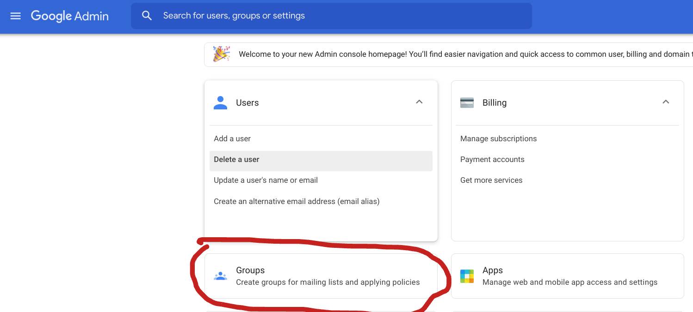
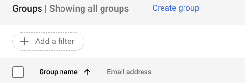
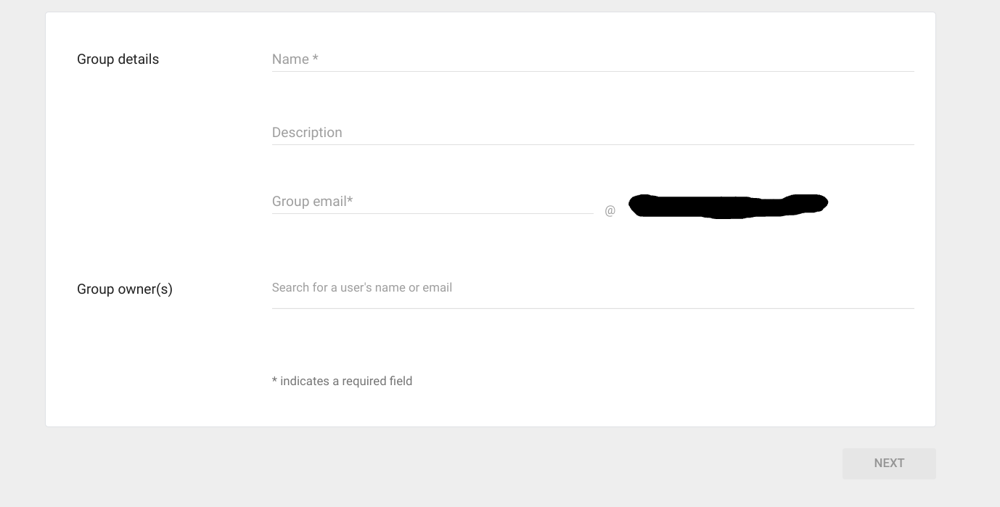

# GCP Accelerator Templates

## Prerequisites

- gcloud sdk >= 206.0.0
- gsutil (included in shell.cloud.google.com)
- Terraform (included in shell.cloud.google.com)
- git (included in shell.cloud.google.com)
- A Google Cloud Organization

## Setting up your Environment

For the easiest path we recommend using Google [Cloud Shell](https://shell.cloud.google.com) to run the deployment as all of the above dependancies are already provided.

You can access Cloud Shell from the GCP console by clicking console icon in the top right corner.

Or run the following to open the shell and auto clone
[](https://console.cloud.google.com/cloudshell/open?git_repo=https://github.com/fmichaelobrien/accelerators_accelerateurs-gcp&page=editor&tutorial=README.md)


This will provision an environment for you to run the commands in.


In the new terminal run the following commands to download the accelerator repository with the bootstrap and terraform scripts.
```
git clone https://github.com/canada-ca/accelerators_accelerateurs-gcp.git
cd accelerators_accelerateurs-gcp/
``` 

### Stage 0 - Bootstrap

This stage includes a bootstrap shell script which will create the following resources needed to run the Terraform Scripts in Stage 1.

- Project to store the Seed Project Resources
- Service Account for Terraform with the following permissions
    - roles/billing.user
    - roles/compute.networkAdmin
    - roles/compute.xpnAdmin
    - roles/iam.organizationRoleAdmin
    - roles/orgpolicy.policyAdmin
    - role/resourcemanager.folderAdmin
    - roles/resourcemanager.organizationAdmin
    - roles/resourcemanager.projectCreator
    - roles/resourcemanager.projectDeleter
    - roles/resourcemanager.projectIamAdmin
    - roles/resourcemanager.projectMover
    - roles/orgpolicy.PolicyAdmin
    - roles/logging.configWriter
    - roles/resourcemanager.projectIamAdmin
    - roles/serviceusage.serviceUsageAdmin
    - roles/bigquery.dataEditor
    - roles/storage.admin
- Storage Bucket to store the terraform state file for the Guardrails scripts
    - This will be needed to run the Guardrails scripts. The default name for this bucket is `guardrails-asset-bkt`.

Assuming you ran the previous steps you should now have the acclererators_accelerateurs-gcp directory in your Cloud Shell enviornment.

Run the following to move to the `guardrails` directory if you haven't already.

```
cd deployment-templates/Terraform/guardrails/
```

To execute the bootstrap script run the following command and populate the ENV Vars with the correct data. 

```
gcloud config set project your-project
cd 0-bootstrap
./bootstrap.sh -d dept -p your-project'
```

### Stage 1 - Common Resources

This stage you will deploy the resources listed below using the infrastructure as code utility Terraform to provide the base needed to deploy the 30 Guardrails.

- Guardrails Project
- BigQuery Instance for log aggregation
- Log export to BigQuery
- Storage Bucket for Log storage
- Log Export to Storage
- BiqQuery Instance for Billing Data
- Pub/Sub instance for recieving Logs
- The following IAM accounts
    - Audit Config for the Org and Project
    - BQ Log User
    - BQ Data Viewer
    - Billing BQ User
    - Billing BQ Viewer
    - SSC Billing Viewer
    - Billing Viewer
    - Cloud Asset Inventory Viewer
    - Org Policies
    - Resource Location Constraint to prevent resources from being created outside of Canada

To run this section you will need to adjust the generated `variables.tfvar` file to use the correct values for your 3 group mails and run the terraform script.

1. Move to the guardrails dir and prepare to edit the partially generated `variables.tfvar` file.
```
cd ../1-guardrails
```


To edit the new file you can either open it in an command line editor like VIM and Nano or you can use the built in Cloud Shell Editor. 


For this example we will use the Cloud Shell Editor, open it up by first opening the terminal in a new window and then clicking the Open Editor button (this will take a minute or two). Once it is open select `Open Home Workspace` to open home directory in the editor.


Click through the directories to get to the variables file as shown in the below image.


The information that is pre-populated is just placeholder information. Change the values as required by your organization.
| Variable  | Description  | Default  |
|---|---|---|
| org_id | The organization ID. | `none` |
| audit_data_users | audit data user groupThe organization ID. | "group@email.com" |
| billing_account | The ID of the billing account to associate this project with | "BILLING_ID" |
| terraform_service_account | The account which terraform will use to provision the infrastructure. This will be created with the bootstrap script | "tfadmin-DEPT@SEEDPROJECT.iam.gserviceaccount.com" |
| billing_data_users | User group who has access to view billing data | "billing-group@email.com" |
| ssc_broker_users | User group to be used for SSC access. | "ssc-broker-group@email.com" |
| log_export_storage_force_destroy | When deleting a bucket, this boolean option will delete all contained objects. | `true` |
| allowed_regions | Regions that resources will be allowed to deploy to. See [here](https://cloud.google.com/compute/docs/regions-zones) for a list of GCP regions. | ["northamerica-northeast1", "northamerica-northeast2"]  |
| bucket_name | The storage bucket name to be used with the Guardrails Validation tool. This needs to be Globally Unique. | `guardrails-asset-bkt` |


The Billing Data and SSC Broker groups will need to be created in Cloud Identity first or the script will fail. To create the groups navigate to your [Google Admin Portal](admin.google.com) and click on the groups card.



Once in the groups menu you can click the create button to start creating your new group.



Now you will need to fill out the form as shown below to create the group.



Repeat this for both groups and when you have the emails you can update the `variables.tfvar` file with the new emails.

Once the values are updated you can run the Terraform script to provision the necessary infrastructure.

Terraform apply will prompt you for confirmation to proceed.

```
terraform init
terraform apply -var-file variables.tfvar
```

Once the script completes you will have the necessary resources to proceed with the guardrails installation. This process should take about 5 minutes.

## How does using this help enforce the 30 Day Guardrails?

Creates the logging and monitoring resources required by Guardrails #4, 11

Creates the base networking and firewall rules to comply with Guardrails #8,9

Creates and Organization Policy to prevent resources from being deployed outside of the Canadian Region (`northamerica-northeast1`) to comply with Guardrail #5.

## Next Steps

Now that you have a baseline infrastructure set up for the guardrails you can now run the Guardrails Validator tool. Instructions for how to install and run the validator can be found [here](https://github.com/canada-ca/cloud-guardrails-gcp/blob/main/guardrails-validation/README.md)
